# 100 Days Of Code (Kotlin) - Log

### Day 18: Jun 26, 2019 (Wednesday)

**Today's Progress**: 

Finished chapter 5 of Android Programming with Kotlin (Packt), which dealt with more about Material Design and layouts.  Created a scrolling CardView app. Began reading about lambdas in chapter 11 of Head First Kotlin.

**Link to work:** 

[10-projects-layouts-02](https://github.com/mirella4real/100-days-of-kotlin/tree/master/10-projects-layouts-02/CardViewLayout)

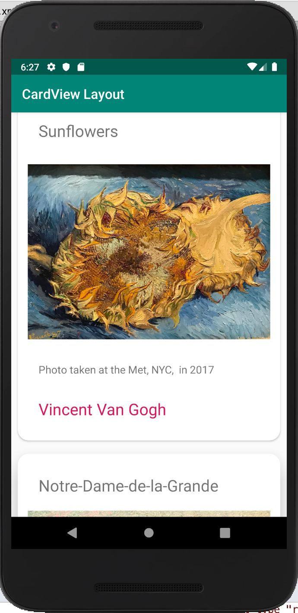

### Day 17: Jun 25, 2019 (Tuesday)

**Today's Progress**: 

Worked on chapter 4 from Android Programming with Kotlin (Packt), which dealt with Material Design and playing with different layouts.  Most of the work was done directly in the Design view of the layout files, but I did get to code a little Kotlin. It was a great refresher on setting view attributes. 

**Link to work:** 

[09-projects-layouts](https://github.com/mirella4real/100-days-of-kotlin/tree/master/09-projects-layouts/ExploringLayouts)

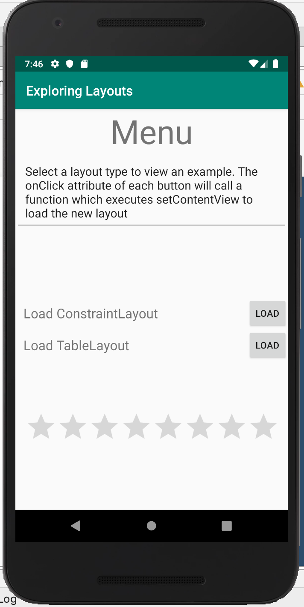

### Day 16: Jun 24, 2019 (Monday)

**Today's Progress**: 

I finished the Tetris project!  Toward the end I was pushing to finish and may not have understood everything that I was doing. However, this practice will be reinforced by theory as I go back to reading more about Kotlin Android dev.  It's pretty cool to run the finished app. 

**Link to work:** 

[08-project-tetris-02](https://github.com/mirella4real/100-days-of-kotlin/tree/master/08-project-tetris-02/Tetris)

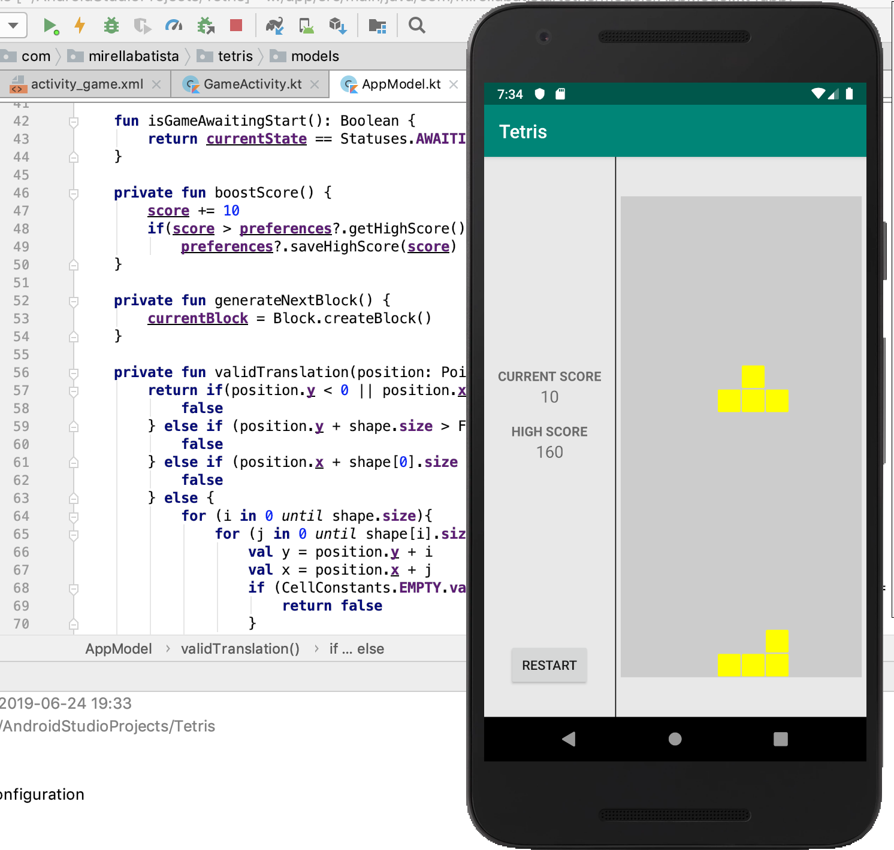

### Days 13, 14 and 15: Jun 19 - June 23rd, 2019 (Thurs, Fri & Sun)

**Today's Progress**: 

Missed 1 day (Saturday) but have added code to Tetris game functionality. Creating the tetrominos out of 0s and 1s and understanding their rotation and movement has been interesting. Also, the project allowed me to see how Java can be used in a Kotlin project.

### Day 12: Jun 19, 2019 (Wednesday)

**Today's Progress**: 

Enough work has been done on the Tetris project that I now have two activities set up and navigation from one to the next. Tetris logic and functionality is next. 

**Link to work:** 

[08-project-tetris-01](https://github.com/mirella4real/100-days-of-kotlin/tree/master/08-project-tetris-01/Tetris)

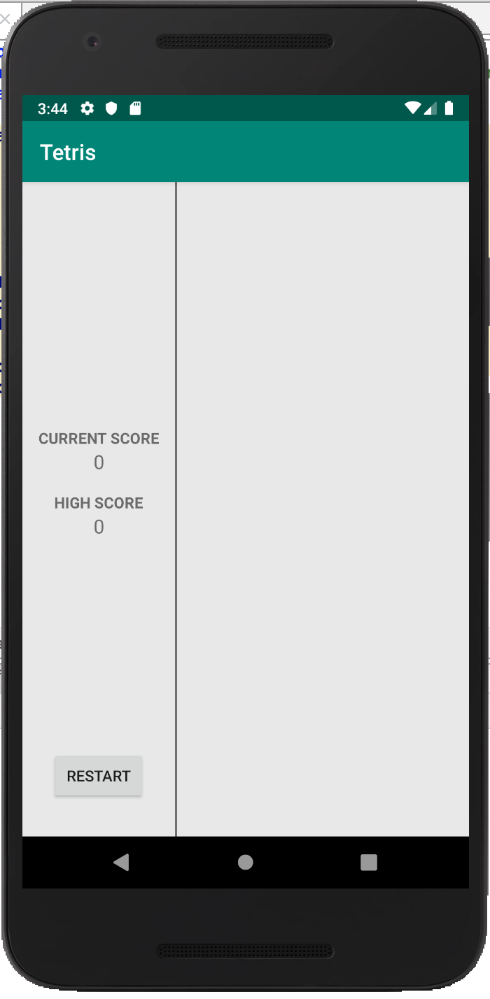

### Day 11: Jun 18, 2019 (Tuesday)

**Today's Progress**: 

Worked on the Tetris project. Refreshing my memory on using SharedPreferences. Seeing the value of Kotlin's safe call operator!

### Day 10: Jun 17, 2019 (Monday)

**Today's Progress**: 

Worked on the Tetris project. Used the safe call operator to hide the app bar and have created event listeners for the buttons.

### Day 9: Jun 16, 2019 (Sunday)

**Today's Progress**: 

Worked on the first screen of the Tetris project, mostly on setting up the layout of the view, adding text fields and buttons.

### Day 8: Jun 15, 2019 (Saturday)

**Today's Progress**: 

Continuing to refresh my memory of all things Android. Began the Tetris project (actual app!) from Kotlin Programming by Example. No link to the work yet, as it will take me a few days.

### Day 7: Jun 14, 2019 (Friday)

**Today's Progress**: 

Trying to jump into actual Android projects, now that I've got some Kotlin under my belt.  Switched to Android Studio while reading Chapters 1-3 of Android Programming with Kotlin (Packt). Created several simple apps and ran them in the emulator. Tomorrow I'm hoping to start an actual app project!

**Thoughts:** 

I'm happy to see that my past Android experience is not wasted when it comes to Kotlin. 

**Link to work:** 

[07-project-first-android-app](https://github.com/mirella4real/100-days-of-kotlin/tree/master/07-project-first-android-app/HelloWorldAgain)

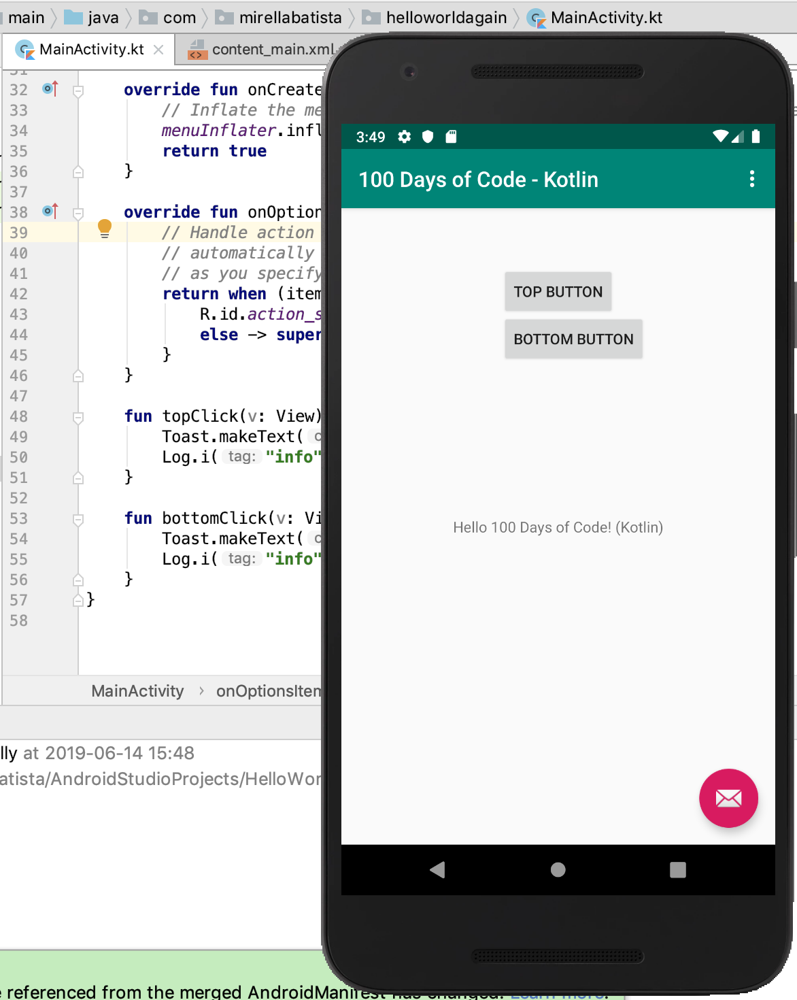

### Day 6: Jun 13, 2019 (Thursday)

**Today's Progress**: 

Back to Head First Kotlin. Finished  Chapter 10, which was about generics. I learned how generics let me write consistent code that is type-safe, and about invariants, covariants and contravariants. 

**Thoughts:** 

I'm not sure I completely grasp generics, so will spend some time re-reading the material.

**Link to work:** 

[06-project-generics](https://github.com/mirella4real/100-days-of-kotlin/tree/master/06-project-generics/Generics)

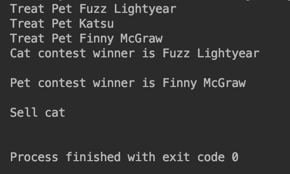

### Day 5: Jun 12, 2019 (Wednesday)

**Today's Progress**: 

I switched gears a little bit and began working through the Kotlin Programming Cookbook. Today I learned how to run a Kotlin program from the command line. I installed the Kotlin compiler on my Mac using Homebrew, created a simple Hello World application and ran it from the command line.
 
I also did a couple of recipes that reinforced what I learned yesterday about collections. 

**Link to work:** 

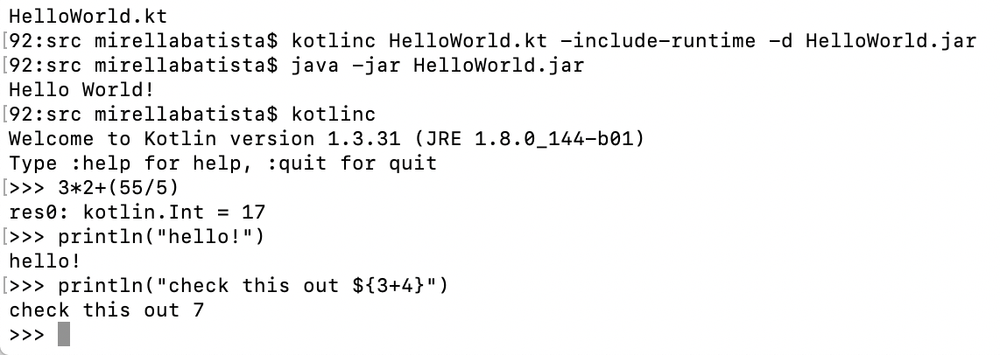

[05-project-collections-practice](https://github.com/mirella4real/100-days-of-kotlin/tree/master/05-project-collections-practice/CollectionsPractice)

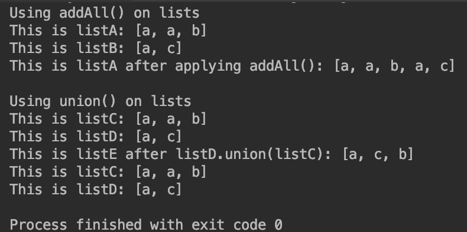

### Day 4: Jun 11, 2019 (Tuesday)

**Today's Progress**: 

Finished chapter 9 of Head First Kotlin.  Learned about handling data in collections: Lists, Sets and Maps
 

**Link to work:** 

[04-project-collections](https://github.com/mirella4real/100-days-of-kotlin/tree/master/04-project-collections/Collections)

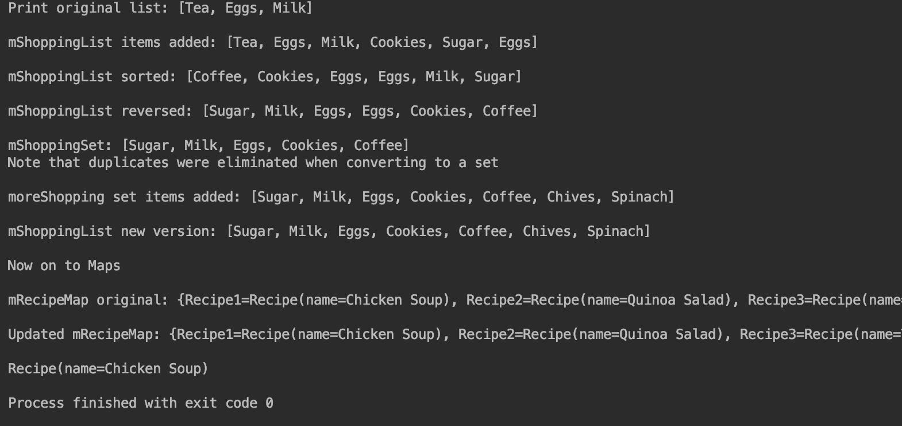

### Day 3: Jun 10, 2019 (Monday)

**Today's Progress**: 

Finished first part of chapter 8 of Head First Kotlin.  Learned about null values in Kotlin, and how to allow variables to be null, how to use the safe call and Elvis operators and let keyword to work with them.

**Thoughts:** 

By default, Kotlin does not accept null values, but provides a work around so that variables can be set to null.  Kotlin also provides a an operator that will allow you to force a nullPointerExeption for testing your code. 

**Link to work:** 

[03-project-null](https://github.com/mirella4real/100-days-of-kotlin/tree/master/03-project-null/Null%20Values)

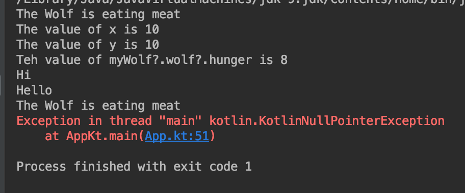

### Day 2: Jun 9, 2019 (Sunday)

**Today's Progress**: 

Finished chapter 7 of Head First Kotlin.  Learned about the Any mother of all superclasses, Data class, deconstruction, secondary constructors, the way Kotlin handles equality and method overloading. 

**Thoughts:** 

Java does not have the concept of default parameter values but I learned that there are workarounds for calling Kotlin classes with default params from Java.

**Link to work:** 

[02-project-data-classes](https://github.com/mirella4real/100-days-of-kotlin/tree/master/02-project-data-classes/Recipes)

### Day 1: Jun 8, 2019 (Saturday)

**Today's Progress**: 

Finished chapters 5 and 6 of Head First Kotlin.  These two chapters dealt with inheritance and polymorphism.  I created a project with an abstract class, a super class and various subclasses. 

**Thoughts:** 

I'm still getting used to the differences between Kotlin and Java. In Java, classes are open by default. In Kotlin, you have to declare a class open by using the open keyword.

**Link to work:** 

[01-project-inheritance](https://github.com/mirella4real/100-days-of-kotlin/tree/master/01-project-inheritance/Animal)

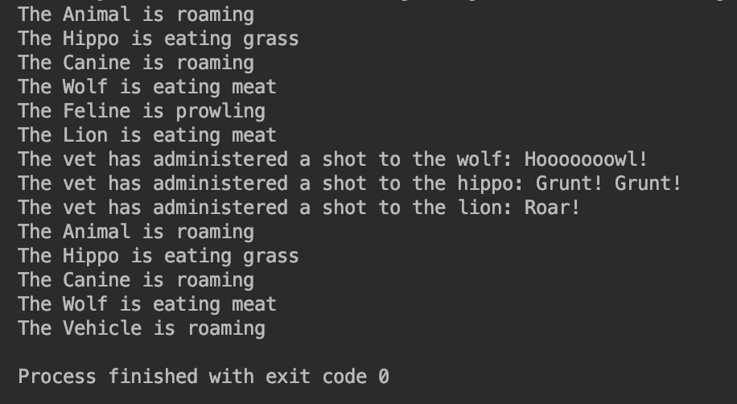

### Day 0: Jun 7, 2019 (Friday)

**Today's Progress**: 

Set up repo and began work on inheritance project.

