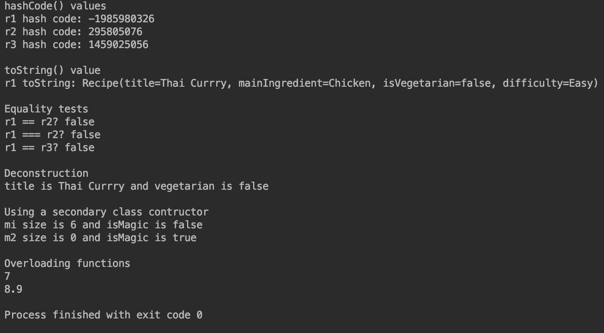

# 100 Days Of Code (Kotlin) - Log

### Day 3: Jun 10, 2019 (Mondauy)

**Today's Progress**: 

Finished first part of chapter 8 of Head First Kotlin.  Learned about null values in Kotlin, and how to allow variables to be null, how to use the safe call and Elvis operators and let keyword to work with them.

**Thoughts:** 

By default, Kotlin does not accept null values, but provides a work around so that variables can be set to null.  Kotlin also provides a an operator that will allow you to force a nullPointerExeption for testing your code. 

**Link to work:** 

[03-project-null](https://github.com/mirella4real/100-days-of-kotlin/tree/master/03-project-null/Null Values)

### Day 2: Jun 9, 2019 (Sunday)

**Today's Progress**: 

Finished chapter 7 of Head First Kotlin.  Learned about the Any mother of all superclasses, Data class, deconstruction, secondary constructors, the way Kotlin handles equality and method overloading. 

**Thoughts:** 

Java does not have the concept of default parameter values but I learned that there are workarounds for calling Kotlin classes with default params from Java.

**Link to work:** 

[02-project-data-classes](https://github.com/mirella4real/100-days-of-kotlin/tree/master/02-project-data-classes/Recipes)

### Day 1: Jun 8, 2019 (Saturday)

**Today's Progress**: 

Finished chapters 5 and 6 of Head First Kotlin.  These two chapters dealt with inheritance and polymorphism.  I created a project with an abstract class, a super class and various subclasses. 

**Thoughts:** 

I'm still getting used to the differences between Kotlin and Java. In Java, classes are open by default. In Kotlin, you have to declare a class open by using the open keyword.

**Link to work:** 

[01-project-inheritance](https://github.com/mirella4real/100-days-of-kotlin/tree/master/01-project-inheritance/Animal)

### Day 0: Jun 7, 2019 (Friday)

**Today's Progress**: 

Set up repo and began work on inheritance project.

